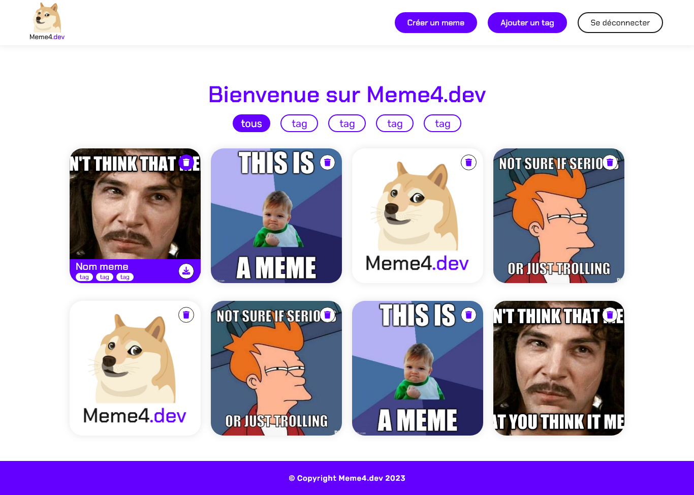
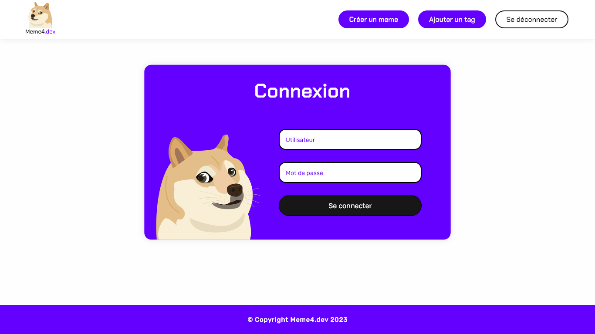
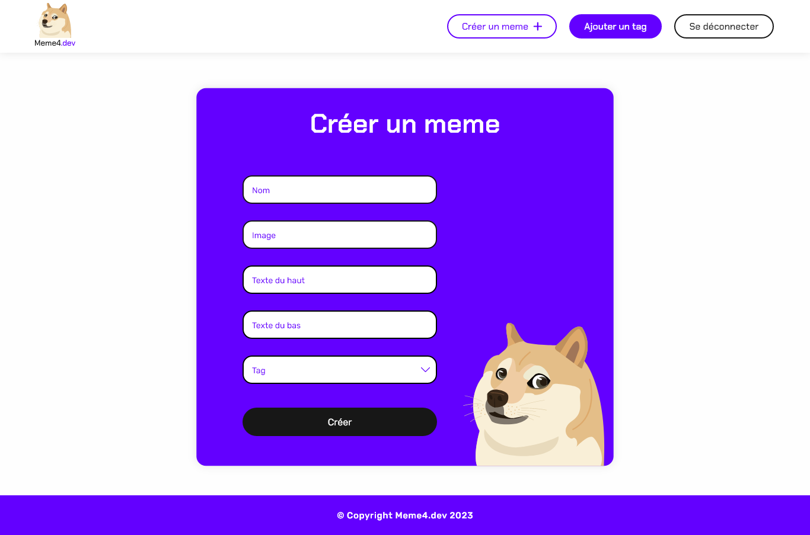
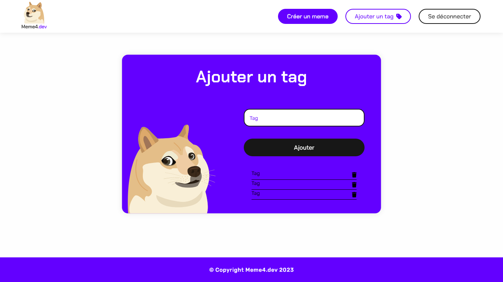

# Meme4.dev

Un projet fictif d'une plateforme de création de memes.

Avec une API en Node.js et Express, un front-end en Vue.js et Tailwind, le tout fonctionnant dans des conteneurs **Docker**.

---

## Présentation

### Frontend

Cette application comporte une arborescence de 4 pages :  

- **`/login`** : Une page de connexion.  
- **`/`** : Une page d'accueil avec tous les memes.  
- **`/creation`** : Une page de création de memes.  
- **`/tag`** : Une page d'ajout et d'affichage des tags.  

### Backend

L'API comporte 5 endpoints :  

- **`/memes`** : Retourne l’ensemble des chemins vers les memes.  
- **`/memes/create`** : Création d’un meme.  
- **`/memes/delete`** : Suppression d’un meme.  
- **`/auth`** : Connexion à l’interface.  
- **`/tags`** : Création, suppression et affichage des tags.  

---

## Installation

Ouvrez un terminal et suivez les étapes ci-dessous :

1. **Démarrage des conteneurs Docker**

    Allez à la racine du projet et exécutez la commande suivante :  

    ```bash
    docker compose up -d --build
    ```

2. **Installation des dépendances NPM**

    a. Placez-vous dans le dossier **backend** et exécutez la commande suivante :

    ```bash
    npm i
    ```

    b. Répétez cette commande dans le dossier **frontend**.

3. **Configuration de Minio**

    a. Accédez à Minio à l'adresse suivante : <http://localhost:9001/browser>  
       - Utilisateur : `minio-root-user`  
       - Mot de passe : `minio-root-password`  

    b. Créez un bucket nommé **`memes-bucket`**.

    c. Configurez le bucket en mode **public**.

---

## Liens d'accès

- **Front-end** : <http://localhost:5173/>  
  - Utilisateur : `admin`  
  - Mot de passe : `admin`  

- **API** : <http://localhost:3000/>

- **Minio (gestion des images)** : <http://localhost:9001/browser>  
  - Utilisateur : `minio-root-user`  
  - Mot de passe : `minio-root-password`  

- **PhpMyAdmin** : <http://localhost:8080>  
  - Utilisateur : `minio-root-user`  
  - Mot de passe : `minio-root-password`  

- **MySQL** : <http://localhost:3306>

---

## Aperçu du projet

### Page d'accueil



### Page de connexion



### Page de création de meme



### Page de gestion des tags


